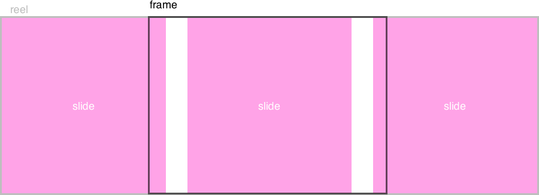

# Diascope
Easily set up an item slider with touch & mouse drag interaction.

## Installation
```
$ npm install diascope --save
```

## Usage
### HTML
The structure of a slider has three parts:

* **frame**: The frame is the window that shows the currently visible slides.
* **reel**: The reel is displayed within the frame, and contains all the slides. Navigation through slides works by changing the offset of the reel. Because of this, you should make sure that the reel's `width` is determined by the slides it contains.
* **slides**: All the available slides.



Consider the following example:

```
<div class="diascope__frame js-diascope-frame">
	<ul class="diascope__reel js-diascope-reel">
		<li class="diascope__slide">slide 1</li>
		<li class="diascope__slide">slide 2</li>
		<li class="diascope__slide">slide 3</li>
	</ul>
</div>
```

The `reel` should be the immediate child of the `frame`. All the direct children of the `reel` are each considered a `slide`.

I'm using `diascope` classnames, but since you're passing all elements in the constructor the naming is for you to decide.

Additionally, I'm using an unordered list, but whether you use `ul` or `div` is irrelevant. In stead what you use should depend on the semantics that best describe the contents of your slider.

### CSS
To make sure the `reel` element has a width that spans all slides without getting cut off by its parent, the reel will have to be `inline`.

Consider the following examples:

```
/* Styling using inline-flex on reel */

.diascope__frame {
	/* Frame width can be anything. */
	width: 100%;

	/* Hide slides outside the frame. */
	overflow: hidden;
}

.diascope__reel {
	/* Display the slides in a row. */
	display: inline-flex;
}
```

```
/* Styling using inline-block on reel */

.diascope__frame {
	/* Frame width can be anything. */
	width: 100%;

	/* Hide slides outside the frame. */
	overflow: hidden;

	/* Prevent the reel and slides from wrapping
	white-space: nowrap;
}

.diascope__reel {
	/* Display inline. */
	display: inline-block;
}

.diascope__slide {
	/* Display the slides in a row. */
	display: inline-block;
}
```

### Constructor
```
import Diascope from 'Diascope';

let frame = document.querySelector('.js-diascope-frame');
let reel = document.querySelector('.js-diascope-reel');
let options = {
	start: 3
};

new Diascope(frame, reel, options);
```

The constructor accepts an optional `options` as its 3rd parameter. It should be an object with any of the following parameters:

#### `step` (Number)
default: `1`

The number of new items to bring into view when navigating through the items.

#### `loop` (Boolean)
default: `false`

Whether to loop around the list when navigating past a first or last item.

#### `shouldCenter` (Boolean)
default: `false`

If set to `true`, visible items are shown centered. Otherwise, they will stick to a side.

#### `elementNavigateNext` (Element)
Pass an `Element` that triggers `next()` when clicked.

#### `elementNavigatePrevious` (Element)
Pass an `Element` that triggers `previous()` when clicked.

#### `drag` (Boolean)
default: `true`

Enable touch and mouse dragging.

#### `elastic` (Boolean)
default: `true`

Determines whether the reel can be dragged loosely out of bounds. The reel will bounce back once released.

#### `animationEasing` (String|Array)
default: `"linear"`

You can define the easing function that should be used for the animation of the reel. You can pass a keyword `String` to set it to a predefined cubic bezier curve:
* `"linear"`
* `"ease"`
* `"easeIn"`
* `"easeOut"`
* `"easeInOut"`

Alternatively, you can pass an `Array` with the coordinates of the second and third control points on the cubic bezier curve, like:

`[p1x, p1y, p2x, p2y]`

This syntax follows the same argument order as CSS' `cubic-bezier` timing function. To understand cubic bezier curves in relation to animation a little better, check out [Lea Verou's cubic bezier playground](http://cubic-bezier.com).

#### `duration` (Number)
default: `250`

The duration of the animation in milliseconds.

#### `onSlideStart` (Function)
A callback function that is called when the reel's position change starts.

#### `onSlideEnd` (Function)
A callback function that is called when the reel's position change ends.

#### `onSlide` (Function)
A callback function that is called with each step of the reel's position change.

### API
An instance of Diascope has the following methods available:

#### `next()`

#### `previous()`

#### `panSlides(pan)`

#### `getVisibleSlides()`
Get all the slides that are currently fully visible in the frame. If no slides are fully visible the *most* visible slide is returned.

#### `addElementNavigateNext(element)`
* **element** (Element)
Add an `Element` that calls `next()` when clicked.

#### `addElementNavigatePrevious(element)`
Add an `Element` that calls `previous()` when clicked.

#### `setAnimationEasing(easing)`
* **easing** (String|Array)

#### `setOnSlideStart(onSlideStart)`
* **onSlideStart** (Function)

#### `setOnSlideEnd(onSlideEnd)`
* **onSlideEnd** (Function)

#### `setOnSlide(onSlide)`
* **onSlide** (Function)
